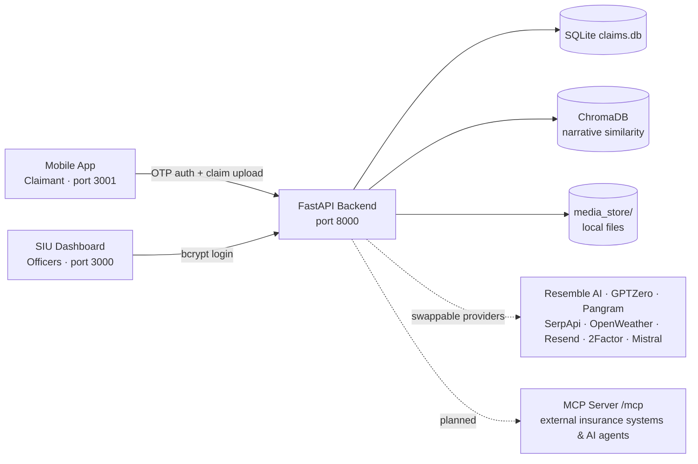
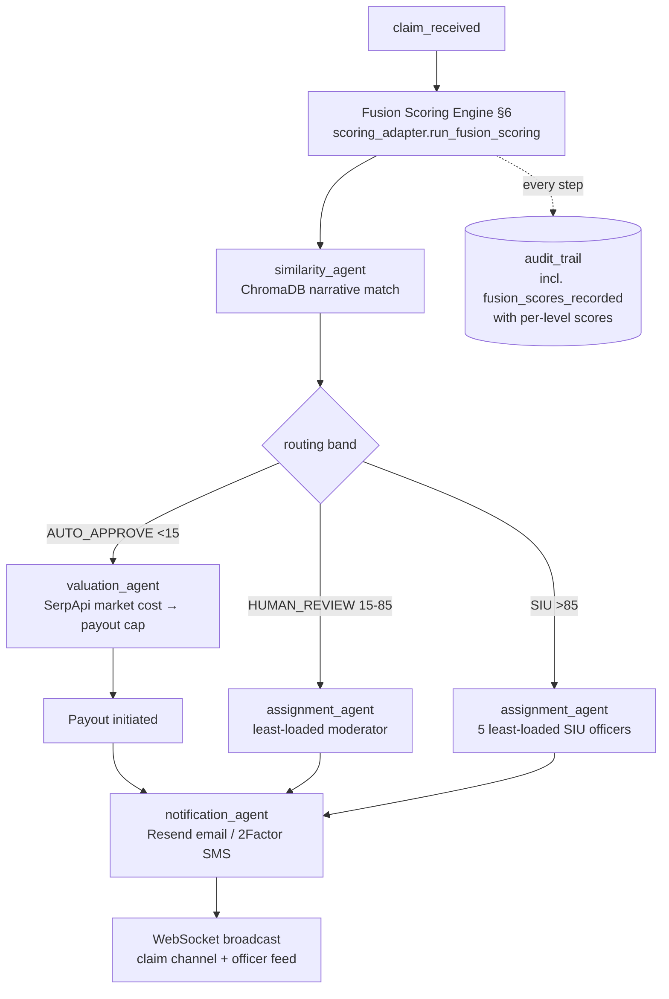

# SyntheticShield — Technical Architecture

> AI-powered deepfake & fraud detection platform for motor insurance claims (FNOL — First Notice of Loss).
> Runs fully local for demo; every external integration sits behind a swappable provider pattern.
> Last updated: 2026-10-04. Audience: engineering + presentation material (slide-ready sections).

---

## 1. System Overview

SyntheticShield ingests motor insurance claims (video, photos, voice statement, written narrative, documents) from a claimant mobile app, scores them for fraud with a **deterministic 6-signal Fusion Scoring Engine** (classical forensics + foreign AI-detection APIs — no LLM in the scoring path), routes them automatically (auto-approve / human review / SIU investigation), and gives claims officers an investigation dashboard with an LLM copilot, quorum voting, explainable score divisions, and exportable forensic PDFs.



**Key design principles**
| Principle | Meaning |
|---|---|
| Deterministic scoring | Same inputs → same score. No LLM, no randomness in the fraud-score path |
| Decomposable | Every final score breaks into 6 sub-scores → per-rule findings (rendered in UI, PDF, copilot) |
| Routes, never denies | Engine outputs a band; humans (moderator / SIU quorum) make denial decisions |
| Append-only evidence | Scores, findings, audit trail are INSERT-only; re-scores create new versions |
| Config-driven | All weights/thresholds in `scoring_config.yaml`, validated at startup |
| Fail-safe | Any analyzer failure → sub-score `unavailable`, weights re-normalize, pipeline never stalls |
| Provider pattern | Every external call behind an ABC selected by env var, with deterministic mock fallback |

---

## 2. Tech Stack

| Layer | Technology |
|---|---|
| API | FastAPI (Python 3.14), uvicorn, Pydantic v2 |
| Persistence | SQLite (`claims.db`) via SQLAlchemy 2.0; lightweight in-place migrations (no Alembic) |
| Vector search | ChromaDB (in-memory), offline MD5-hash embeddings (384-dim) for narrative similarity |
| Pixel forensics | OpenCV (headless), NumPy, SciPy, Pillow, imagehash; ffmpeg/ffprobe on PATH |
| Metadata forensics | piexif, exifread, pypdf; SHA-256 + perceptual hash |
| Speech-to-text | faster-whisper (base model, int8, CPU) — fact extraction only |
| LLM (non-scoring) | Mistral `mistral-small-latest` (OpenAI-compatible API); Gemini impl available; swappable |
| PDFs | ReportLab (forensic audit, case files, digest reports) |
| Frontends | React 18 + Vite + TypeScript — two standalone apps, inline styles (no CSS framework), lucide-react icons |
| Realtime | Native WebSockets (per-claim channel + officer feed) |
| Tests | pytest + pytest-asyncio; in-memory SQLite per test; 120+ tests |

---

## 3. Repository Layout

```
synthetic shield/
├── FRAUD_FUSION_SCORING_SPEC.md     # scoring engine implementation spec
├── backend/
│   ├── claims.db                    # SQLite (runtime)
│   ├── scoring_config.yaml          # ALL scoring weights/thresholds (config_version stamped)
│   ├── seed_data.py                 # demo users/policies/officers
│   ├── rescore_audio_text.py        # one-off demo backfill script
│   ├── app/
│   │   ├── main.py                  # app wiring, CORS, static /media, migrations, config validation
│   │   ├── config.py                # pydantic-settings (env vars)
│   │   ├── database.py / models.py / schemas.py
│   │   ├── security.py              # bcrypt hash/verify + legacy upgrade
│   │   ├── auth_deps.py             # session guards (user vs officer, ?token= fallback)
│   │   ├── ws_manager.py            # WebSocket broadcast singleton
│   │   ├── report_generators.py / report_pdf.py   # ReportLab PDFs
│   │   ├── agents/                  # pipeline agents (see §5)
│   │   ├── scoring/                 # Fusion Scoring Engine (see §6)
│   │   ├── providers/               # storage, OTP, LLM, legacy detection vendors
│   │   └── routers/                 # auth, claims, moderator, siu, copilot, similarity,
│   │                                #   efficiency, downloads, policies, ws
│   └── tests/                       # incl. tests/scoring/ (fusion spec suite)
├── frontend/
│   ├── dashboard/                   # officer SPA (port 3000)
│   └── mobile/                      # claimant SPA (port 3001)
├── demo/                            # Playwright demo recorders (Edge channel, fake mic)
└── instruction/                     # backend build spec
```

---

## 4. Data Model (SQLite — 20 tables)

**Identity & policy**: `users`, `otp_codes`, `sessions` (`owner_type` = user|officer), `claims_officers` (bcrypt `password_hash`, roles: senior / siu_officer / moderator), `policies`, `coverages`.

**Claims & evidence**: `claims` (media URLs, `transcript_text`, `fraud_confidence_score`, `consistency_score`, `narrative_similarity_score`, `artifact_report` JSON, `claim_amount_cents`, `valuation_report` JSON, payout fields, `status`), `claim_documents`, `claim_media_analysis` (one row per signal: modality, provider, raw_score, findings JSON).

**Adjudication**: `moderator_actions`, `siu_reviews`, `siu_officer_votes` (unique per officer), `claim_assignments` (workload tracking, both review types).

**Money & comms**: `payouts`, `notifications_log`.

**Immutable records** (SQLAlchemy `before_update`/`before_delete` listeners raise):
- `audit_trail` — every pipeline step, officer action, copilot tool call
- `claim_scores` — one row per scoring run (`claim_id`+`version` unique, `config_version`, base/final score, band, full `breakdown_json`)
- `score_findings` — per-rule findings linked to a score row
- `evidence_hashes` — SHA-256 + pHash of every image/keyframe (internal reverse-image search)

**Claim status lifecycle**: `processing → auto_approved | moderator_review | siu_investigation → (rejected | siu_confirmed_fraud | siu_cleared)`. Human decisions never retro-change; re-scores only append new score versions.

---

## 5. Claim Processing Pipeline (agents/)

`POST /claims` (multipart: video and/or image, required audio, optional PDFs, claim amount) → claim row (`processing`) → fire-and-forget async task:



- **scoring_adapter.py** bridges the engine to the product: maps `ScoreBreakdown` → `artifact_report` JSON (dashboard shape), writes `claim_media_analysis` rows, sets claim status from the band, logs the per-level score audit event.
- **report_synthesizer.py** (LLM, *downstream of scoring*) rewrites the artifact-report narrative into officer-readable English; silent fallback to template text.
- **valuation_agent.py** (auto-approve only): extracts damaged part, queries SerpApi market prices, caps payout at `min(claimed, market estimate)`.
- **assignment_agent.py**: workload-balanced via `claim_assignments` counts.
- Legacy `detection_agent.py` + Reality Defender provider remain on disk but are **out of the scoring path** (replaced 2026-09-29).

---

## 6. Fraud Fusion Scoring Engine (`app/scoring/`)

Six sub-scores, 0–100, higher = more suspicious. **No LLM anywhere in this path.**

### Level 1 — Metadata Analysis (`S_metadata`, weight 0.10) — in-house
Rule battery over every uploaded file (EXIF via piexif, containers via ffprobe, PDFs via pypdf):
- **HIGH +35**: M-H1 editor trace (Photoshop/GIMP/…), M-H2 GPS >25 km from incident, M-H3 impossible timestamp, M-H4 duplicate evidence (SHA-256/pHash match vs other claims), M-H5 screenshot signature
- **MEDIUM +20**: M-M1 modify-gap + editor tag, M-M2 timezone inconsistency, M-M3 re-saved PDF, M-M4 missing camera fields on in-app capture
- **LOW +8**: M-L1 stripped EXIF (deliberately weak — messaging apps), M-L2 generic PDF producer
- **CREDITS**: M-C1 valid C2PA manifest −25, M-C2 intact consistent EXIF −8
- `S_metadata = clamp(Σ points, 0, 100)`

### Level 2 — AI Manipulation Analysis (weights: image 0.22, video 0.22, audio 0.18, text 0.08)
- **`S_image` — in-house pixel forensics** (no vendor): weighted components —
  ELA 0.20 · JPEG double-quantization 0.35 (true DCT via jpegio when available; cv2 DCT fallback on Windows) · noise-consistency "PRNU-style" 0.25 · generative frequency artifacts 0.20 (+ missing-JPEG-blocking floor 60). PNG skips DQ and re-normalizes. Multi-photo = max over files.
- **`S_video` — in-house frame-level**: 1 fps sampling (cap 60 frames) → per-frame image battery; temporal checks (residual-variance z-score spikes, Farneback optical-flow reversals/jumps). `S_video = 0.7·p95(frames) + 0.3·temporal`.
- **`S_audio` — foreign detector**: Resemble AI Detect (probability-of-fake × 100), retries + timeout, direction constant asserted in tests.
- **`S_text` — foreign detectors cross-checked**: GPTZero (primary) + Pangram (secondary). Agreement (|g−p| ≤ 25) → conservative `min`; disagreement → average + visible finding.
- *Demo mode*: audio/text fall back to a deterministic mock when API keys are absent or a live call fails — real APIs activate via env keys with zero code change.

### Level 3 — Consistency Check (`S_consistency`, weight 0.20) — in-house rules
Deterministic cross-evidence rules over `IncidentFacts` (keyword-map extraction from written statement + voice transcript via local faster-whisper STT):
- C-H1 +45 hard narrative contradiction (front vs rear, left vs right across voice/written/photos)
- C-H2 +45 weather contradiction (OpenWeather historical, ±6 h window)
- C-H3 +50 external reverse-image web match (SerpApi Lens; internal hash match first) — `escalation_eligible`
- C-M1 +25 media predates incident; C-M2 +15/+30 per-part price inflation (SerpApi median, ≥3 price points, cache 7 d); C-M3 +25 damage-pattern implausibility matrix; C-L1 +10 minor discrepancy
- Also emits informational `payout_cap = min(claimed, Σ market·1.35, coverage limit)`

### Fusion (`fusion.py`)
```
Base  = Σ wᵢ·Sᵢ  over status=="ok" signals, weights re-normalized over available signals
S_max = max over L2 AI-manipulation signals ONLY (image/video/audio/text — product decision 2026-10-01)
        plus any escalation_eligible finding as virtual signal max(subscore, 92)   # C-H3
Final = max(Base, S_max − 5) if S_max ≥ 90 else Base          # worst-signal escalation
Band  : <15 AUTO_APPROVE · 15–85 HUMAN_REVIEW · >85 SIU_INVESTIGATION
Forced review (upgrade only): failed image/video analysis on present media, or ≥3 signals unavailable
```
Output = `ScoreBreakdown` (pydantic): sub-scores + findings + weights used + base/final + escalation + band + payout cap → persisted append-only, stamped with `config_version`.

**Verified worked examples** (pinned in tests): clean claim Base 4.84 → AUTO_APPROVE; AI-photos Base 61.42 → escalation via image 96 → Final 91 SIU; edited-but-plausible Base 29.76 → HUMAN_REVIEW.

---

## 7. API Surface (selected)

| Area | Endpoints |
|---|---|
| Auth | `POST /auth/request-otp`, `/auth/verify-otp` (mobile); `POST /auth/dashboard-login`, `POST /auth/logout` (officers) |
| Claims | `POST /claims` (multipart submit) · `GET /claims/queue/all` (dashboard master list incl. artifact_report + audit trail) · `GET /claims/{id}/details` · `GET /claims/case-files` |
| Scoring | `GET /claims/{id}/score-breakdown` (latest version + history) |
| Adjudication | `POST /claims/{id}/moderator-approve` / `moderator-reject` · `POST /claims/{id}/siu-vote` · `GET /claims/{id}/siu-status` |
| Copilot | `POST /claims/{id}/copilot-chat` · `GET /claims/{id}/copilot-history` |
| Similarity | `GET /similarity/search` · `GET /similarity/claim/{id}` · `POST /similarity/reindex` |
| Ops | `GET /efficiency/officers` · `GET /efficiency/workload-summary` |
| Exports | `GET /downloads/forensic-audit/{id}` (PDF incl. score-division table) · `/downloads/report/...` · `/downloads/case/...` |
| Realtime | `WS /ws/claims/{id}` (claimant live status) · `WS /ws/officer-feed` (dashboard) |

Auth model: Bearer session tokens (12 h expiry); officer download links pass `?token=` (headers impossible on `<a href>`); SIU quorum = unanimous `confirm_fraud` to confirm, any `clear` vote clears + pays out; panel size from `claim_assignments`.

---

## 8. Officer Copilot (LLM agent — non-scoring)

Mistral-backed tool-calling agent, hard-grounded to one claim, every tool call audit-logged:

| Tool | Purpose |
|---|---|
| `get_claim_evidence_summary` | Stored findings, per-signal scores, valuation, payout — no external calls |
| `get_fraud_score_breakdown` | Score division by level (L1 metadata / L2 AI manipulation / L3 consistency) with weights, components, findings, base/final, escalation, band |
| `search_repair_cost_estimate` | Live SerpApi search + LLM price extraction with source snippets |
| `run_image_forensics_reanalysis` | On-demand deep second opinion: 5 parallel vision-LLM specialists + supervisor synthesis — informational only, never changes the official score |

Prompt enforces: answer only from tool output, dollars not cents, <150 words, no raw JSON. Rule-based fallback responder when no LLM key is configured.

---

## 9. Frontends

**SIU Dashboard** (`frontend/dashboard`, port 3000) — officer SPA:
- Tabs: Claims Queue · Analytics · Case Files · Lifecycle · Efficiency (senior only) · Reports
- Claim detail: evidence viewers, fraud gauge, **ScoreBreakdownPanel** (per-level score bars + expandable component/finding rows + fusion summary — shown for every claim regardless of outcome), AI findings, audit trail, copilot chat, moderator actions / SIU quorum voting, payout panel for auto-approved
- Lifecycle tab: per-claim flowchart of audit events with detail chips (includes `fusion_scores_recorded` per-level scores)
- Header: notifications, **MCP server menu** (plug icon — endpoint status + Connected Systems / Tool Catalog / API Keys / Connection Logs / Integration Guide, demo "SOON" state), profile dropdown with live **logout** (invalidates server session)
- Live refresh: 5–8 s polling + WebSocket officer feed

**Mobile app** (`frontend/mobile`, port 3001) — claimant SPA:
- OTP login (email/SMS via Resend/2Factor) → 6-step FNOL wizard: Coverage → Video → Photos → Statement (mic recording) → Documents → Review
- Post-submit: live status via `WS /ws/claims/{id}` → payout confirmation / review status screen

No mock data anywhere — both apps render live backend state with empty-states.

---

## 10. Testing & Quality

- `backend/tests/` — 120+ tests: auth, claims flows, copilot tools, mock providers, report synthesizer
- `backend/tests/scoring/` — spec §10 suite: determinism (byte-identical breakdowns), 3 worked examples to 2 decimals, weight re-normalization, fail-safe/forced-review, escalation edges (90 vs 89.99), escalation restricted to L2 signals, C-H3 virtual-signal escalation, append-only enforcement, no-denial invariant (routing enum has exactly 3 bands), WhatsApp stripped-EXIF nuance, PNG component gating
- Demo mode: `SCORING_DEMO_MODE=1` forces all mock providers (used by CI/tests)
- Platform notes: Windows TLS fixed via `truststore.inject_into_ssl()`; `jpegio` has no Windows wheels → cv2 DCT fallback

---

## 11. Configuration (env vars)

| Group | Vars |
|---|---|
| Scoring providers | `AUDIO_DETECTOR_PROVIDER=resemble`, `TEXT_DETECTOR_PRIMARY=gptzero`, `TEXT_DETECTOR_SECONDARY=pangram`, `REVERSE_SEARCH_PROVIDER=serpapi`, `PART_PRICING_PROVIDER=serpapi`, `WEATHER_PROVIDER=openweather`, `STT_PROVIDER=faster_whisper`, `SCORING_DEMO_MODE` |
| Vendor keys | `RESEMBLE_AI_API_KEY` ✅ · `SERPAPI_API_KEY` ✅ · `MISTRAL_API_KEY` ✅ · `RESEND_API_KEY` ✅ · `TWOFACTOR_API_KEY` ✅ · `GPTZERO_API_KEY` ⬜ · `PANGRAM_API_KEY` ⬜ · `OPENWEATHER_API_KEY` ⬜ (⬜ = mock fallback active) |
| Thresholds | `AUTO_APPROVE_BELOW=15`, `SIU_FLAG_ABOVE=85` (+ full scoring config in `scoring_config.yaml`, `config_version 0.1.0-design` — design-stage values pending calibration) |
| Misc | `DATABASE_URL`, `CORS_ORIGINS`, `PUBLIC_BASE_URL`, `OTP_PROVIDER`, `MOCK_PAYOUT_AMOUNT_CENTS` |

**Run locally**: backend `uvicorn app.main:app --reload --port 8000` (from `backend/`, venv) · each frontend `npm run dev` · seed `python seed_data.py`.

---

## 12. MCP Server — Feasibility Study (researched 2026-10-04)

**Goal**: let external insurance systems and their AI agents (Guidewire/Duck Creek copilots, Claude/Copilot Studio deployments, in-house agent platforms) invoke SyntheticShield directly via the **Model Context Protocol**.

### Verdict: ✅ Feasible — low effort, codebase is unusually well-positioned

| Check | Finding |
|---|---|
| SDK | Official `mcp` Python SDK v2.3.0 (PyPI, MIT, actively maintained) |
| Runtime | Requires Python 3.10+ — we run 3.14.6 ✅ |
| Transport | **Streamable HTTP** (current standard; SSE deprecated) — SDK builds a Starlette ASGI app that can be **mounted inside our existing FastAPI app at `/mcp`** or run standalone |
| Auth | SDK ships an OAuth 2.1 authorization layer (token verifier hook) for HTTP transport |
| Testing | In-memory `Client(mcp)` — plugs into our pytest suite without ports/subprocesses |
| Tool definition | `@mcp.tool()` on type-hinted functions — our business logic already lives in plain callables (`get_claim_evidence_summary`, `get_fraud_score_breakdown`, `run_scoring`, …), so tools are thin wrappers |

### Positioning
MCP is the **AI-agent-facing layer on top of** our REST API — not a replacement for system-to-system REST/batch integration. It answers: *"let the insurer's AI assistant ask SyntheticShield to score a claim and explain the verdict."*

### Proposed tool catalog (phase 1 → 2)
| Tool | Phase | Wraps |
|---|---|---|
| `get_claim_status` / `list_claims_queue` | 1 (read-only) | claims router queries |
| `get_score_breakdown` | 1 | `ClaimScore` latest version (per-level division) |
| `get_evidence_summary` | 1 | copilot tool fn |
| `search_similar_claims` | 1 | similarity agent |
| `get_forensic_report` | 1 | PDF generator (resource/link) |
| `submit_claim` (media **by URL**, not base64) | 2 | storage intake + `process_claim` |
| `get_siu_status`, `request_rescore` | 2 | siu router / scoring orchestrator |

### Required changes (not yet made)
1. **Small**: `app/mcp_server.py` (`MCPServer("synthetic-shield")` + tool wrappers), mount at `/mcp` in `main.py`, add `mcp` dependency, in-memory client tests — *~1–2 days for a demo-grade read-only server with static API key*
2. **Medium (partner-ready, ~1 week)**:
   - Real **authentication**: per-partner API keys or OAuth 2.1 via the SDK's token verifier (current session auth is demo-grade)
   - **Evidence ingestion by URL** (MCP body cap defaults to 4 MiB — base64 video is wrong): new intake path in `storage.py` with SSRF-guarded downloads
   - **Tenant/claim scoping** per connected partner + rate limiting
   - **Audit**: log every MCP tool call to `audit_trail` (same pattern as copilot tools)
3. **Production hardening** (beyond demo): SQLite → Postgres for concurrent external traffic, public HTTPS, `transport_security` (DNS-rebinding protection)

### Risks / constraints
- MCP hosts must speak Streamable HTTP (modern hosts do; SSE-only legacy clients are handled by an SDK compat layer)
- Media-heavy workflows need the URL-ingestion pattern — tool-call payloads are not a file transport
- Multi-insurer isolation is the main real engineering work, not the protocol itself

### UI status
The dashboard header already surfaces the capability: **MCP menu (plug icon)** showing the planned endpoint (`http://localhost:8000/mcp`), server-ready status, and placeholder entries (Connected Systems, Tool Catalog, API Keys & Access, Connection Logs, Integration Guide) that will go live with the rollout.

---

## 13. Known Gaps / Deliberate Demo Shortcuts

- Scoring weights/penalties are **design-stage** (`0.1.0-design`) — calibration on labeled historical claims pending
- GPTZero/Pangram/OpenWeather keys not yet configured → deterministic mock fallback (flagged in provider attribution)
- `text.min_chars` lowered 300 → 40 for demo; ChromaDB in-memory (similarity index rebuilt via `/similarity/reindex`); `officer_id` hardcoded in moderator router; SQLite single-writer
- Legacy claims (pre-engine) carry synthesized score breakdowns coherent with their historical outcomes; statuses were never retro-changed
